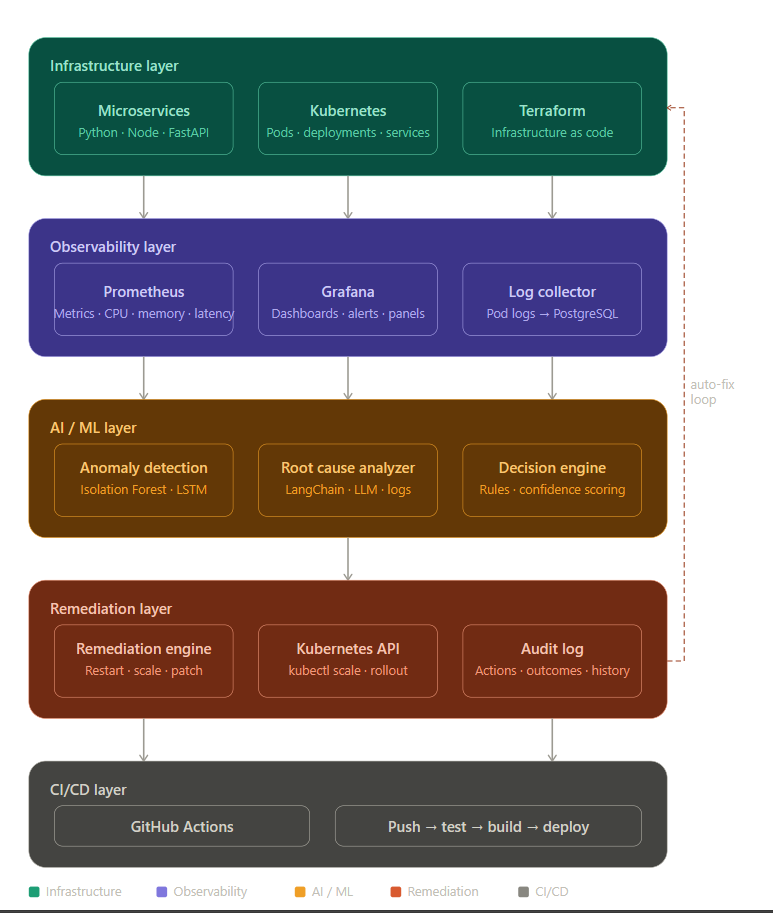

# AI Self-Healing Infrastructure Platform

> An AIOps system that automatically monitors, diagnoses, and fixes infrastructure issues using ML anomaly detection and LLM-powered root cause analysis.

## Architecture



## Tech Stack

| Layer | Technology |
|---|---|
| Infrastructure | Docker, Kubernetes (Minikube) |
| Monitoring | Prometheus, Grafana |
| Log Pipeline | Python, PostgreSQL |
| Anomaly Detection | Isolation Forest, LSTM |
| Root Cause Analysis | LangChain, GPT |
| Auto Remediation | Kubernetes API |
| CI/CD | GitHub Actions |
| IaC | Terraform |

## Project Status

| Week | Goal | Status |
|---|---|---|
| Week 1 | Project foundation + Kubernetes | Done |
| Week 2 | Monitoring stack | In progress |
| Week 3 | Log pipeline | Upcoming |
| Week 4 | Anomaly detection | Upcoming |
| Week 5 | LLM root cause analysis | Upcoming |
| Week 6 | Auto remediation | Upcoming |
| Week 7 | CI/CD + Terraform | Upcoming |
| Week 8 | Polish + demo | Upcoming |

## Quick Start
```bash
minikube start --driver=docker --memory=3000 --cpus=2
kubectl get nodes
```
