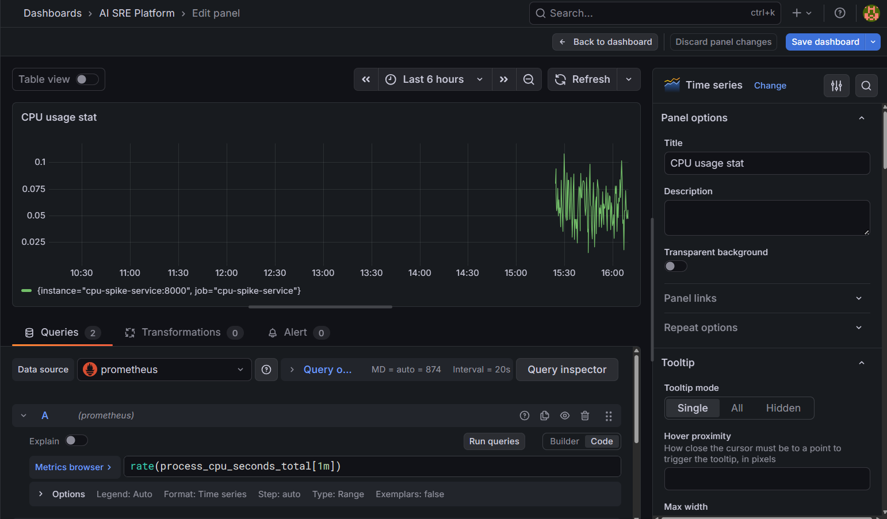
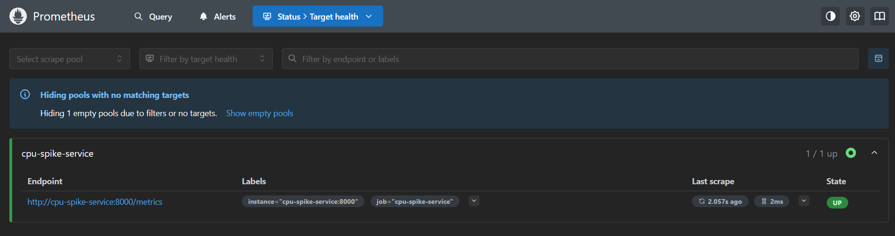
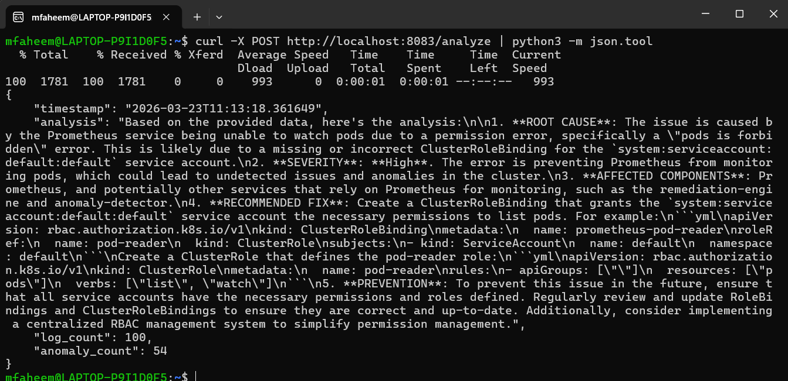

# AI Self-Healing Infrastructure Platform


> An end-to-end AIOps platform that automatically monitors, diagnoses, and heals Kubernetes infrastructure using ML anomaly detection and LLM-powered root cause analysis — no human intervention required.

---

## Demo

| Grafana CPU Spike Dashboard | Prometheus Targets | LLM Root Cause Analysis |
|---|---|---|
|  |  |  |

Other demo images in docs
---

## What It Does

When a CPU spike or service failure occurs, the platform:

1. **Detects** the anomaly using an Isolation Forest ML model trained on Prometheus metrics
2. **Collects** logs from all Kubernetes pods into PostgreSQL
3. **Analyzes** the root cause using Llama 3.3 70B LLM via Groq API
4. **Fixes** the issue automatically — restarts pods or scales deployments via Kubernetes API
5. **Records** every action taken in an audit log

Total time from anomaly to fix: **under 60 seconds**

---

## Architecture
```
Microservices (Kubernetes)
        │
        ▼
Prometheus metrics scraping (15s interval)
        │
        ▼
Isolation Forest anomaly detection model
        │
        ├──► Log Collector → PostgreSQL storage
        │
        ▼
Llama 3.3 70B LLM root cause analysis
        │
        ▼
Remediation Engine → Kubernetes API
        │
        ├──► Scale deployment (replicas: 1→3)
        └──► Restart crashed pods
```

---

## Tech Stack

| Layer | Technology | Purpose |
|---|---|---|
| Orchestration | Kubernetes (Minikube) | Container orchestration |
| Metrics | Prometheus | Time-series metrics collection |
| Visualization | Grafana | Real-time dashboards and alerts |
| Log Storage | PostgreSQL | Centralized pod log storage |
| Anomaly Detection | Isolation Forest (scikit-learn) | ML-based anomaly detection |
| Root Cause Analysis | Llama 3.3 70B via Groq | LLM-powered log analysis |
| Auto Remediation | Kubernetes Python SDK | Automated pod scaling and restart |
| CI/CD | GitHub Actions | Automated lint, test, Docker build |
| IaC | Terraform | Infrastructure as code |
| Language | Python 3.11 | All services |

---

## Services

| Service | Port | Description |
|---|---|---|
| cpu-spike-service | 8000 | Simulates CPU spikes for testing |
| log-collector | 8001 | Collects pod logs into PostgreSQL |
| anomaly-detector | 8002 | ML model detecting metric anomalies |
| root-cause-analyzer | 8003 | LLM analysis of logs and anomalies |
| remediation-engine | 8004 | Auto-fixes detected issues |
| prometheus | 9090 | Metrics collection and storage |
| grafana | 3000 | Dashboards and visualization |
| postgres | 5432 | Log database |

---

## Key Numbers

- **8 microservices** running simultaneously on Kubernetes
- **15 second** Prometheus scrape interval for real-time monitoring
- **10 data points** needed before anomaly model starts detecting
- **< 60 seconds** from anomaly detection to auto-remediation
- **100 anomalies** stored in memory with severity scoring
- **30 second** log collection interval from all pods
- **7 GitHub Actions** CI runs — lint, test, Docker build on every push
- **3x scale-up** triggered automatically on high severity anomalies

---

## Quick Start

### Prerequisites
- Docker Desktop
- WSL2 (Windows) or Linux/macOS
- Minikube
- kubectl

### Run locally
```bash
# Clone the repo
git clone https://github.com/MFaheemS/ai-sre-platform.git
cd ai-sre-platform

# Start Minikube
minikube start --driver=docker --memory=3000 --cpus=2

# Deploy all services
kubectl apply -f k8s/base/
kubectl apply -f k8s/monitoring/

# Verify all pods are running
kubectl get pods

# Access Grafana dashboard
kubectl port-forward service/grafana 3000:3000
# Open http://localhost:3000 (admin/admin123)

# Trigger a CPU spike
kubectl port-forward service/cpu-spike-service 8080:8000
curl http://localhost:8080/spike

# Run LLM root cause analysis
kubectl port-forward service/root-cause-analyzer 8083:8003
curl -X POST http://localhost:8083/analyze
```

---

## Project Structure
```
ai-sre-platform/
├── services/
│   ├── cpu-spike-service/    # Test microservice with CPU spikes
│   └── log-collector/        # Kubernetes log collection pipeline
├── monitoring/
│   ├── prometheus/           # Prometheus config
│   └── grafana/              # Grafana dashboards
├── k8s/
│   ├── base/                 # All deployment manifests
│   └── monitoring/           # Prometheus + Grafana manifests
├── ml/
│   └── anomaly-detection/    # Isolation Forest anomaly detector
├── llm/
│   └── root-cause-analyzer/  # LLM root cause analysis service
├── remediation/              # Auto remediation engine
├── terraform/                # Infrastructure as code
├── .github/workflows/        # GitHub Actions CI/CD pipeline
└── docs/
    └── screenshots/          # Dashboard and system screenshots
```

---

## Resume Bullets

- Built end-to-end AIOps platform with 8 microservices on Kubernetes for automated infrastructure self-healing
- Implemented ML anomaly detection using Isolation Forest on Prometheus time-series metrics with < 60s detection-to-fix cycle
- Integrated Llama 3.3 70B LLM via Groq API for automated root cause analysis of Kubernetes pod logs
- Built auto-remediation engine using Kubernetes Python SDK — automatically scales deployments and restarts crashed pods
- Deployed full observability stack with Prometheus (15s scrape interval) and Grafana dashboards showing real-time CPU metrics
- Established CI/CD pipeline with GitHub Actions — automated lint, test, and Docker image builds on every push
- Centralized pod log collection pipeline storing logs in PostgreSQL with REST API for querying by pod name
- Defined infrastructure as code using Terraform with Kubernetes provider


---

## Author

**Muhammad Faheem**
- GitHub: [@MFaheemS](https://github.com/MFaheemS)
